# SureShot_mk1

**An open-source 16-switch USB-MIDI pad for finger drummers**

SureShot_mk1 is a DIY MIDI controller built on Arduino Leonardo-compatible hardware. It sends MIDI note messages over USB, letting you trigger samples, drums, and instruments in any DAW — no extra drivers required.

> Project lead: **Nitroplazma** — finger drummer / programmer

---

## System Overview

```mermaid
graph LR
    A["🎛️ 16 Tactile<br/>Switches"] -->|Digital I/O| B["🔧 ATmega32U4<br/>(Arduino Leonardo)"]
    B -->|USB-MIDI| C["💻 DAW / Software<br/>(Ableton, FL Studio, etc.)"]

    style A fill:#2d3436,stroke:#00b894,color:#dfe6e9
    style B fill:#2d3436,stroke:#0984e3,color:#dfe6e9
    style C fill:#2d3436,stroke:#6c5ce7,color:#dfe6e9
```

## How It Works

## Repository Structure

```mermaid
graph TD
    ROOT["📁 SureShot_mk1"] --> HW["📁 Hardware<br/><i>Schematics & PCB design</i>"]
    ROOT --> SW["📁 Software/SureShot_mk1<br/><i>Arduino sketch (.ino)</i>"]
    ROOT --> CB["📁 custom_board<br/><i>Custom board definitions<br/>for Arduino IDE</i>"]
    ROOT --> LIC["📄 LICENSE<br/><i>MIT License</i>"]
    ROOT --> README["📄 README.md"]

    style ROOT fill:#1e272e,stroke:#f5f6fa,color:#f5f6fa
    style HW fill:#2d3436,stroke:#fdcb6e,color:#fdcb6e
    style SW fill:#2d3436,stroke:#74b9ff,color:#74b9ff
    style CB fill:#2d3436,stroke:#a29bfe,color:#a29bfe
    style LIC fill:#2d3436,stroke:#636e72,color:#b2bec3
    style README fill:#2d3436,stroke:#636e72,color:#b2bec3
```

## Hardware

| Component | Details |
|---|---|
| **MCU** | ATmega32U4 (Arduino Leonardo compatible) |
| **Buttons** | 16 × tactile switches (digital input) |
| **Connection** | USB (native USB-MIDI, no bridge chip needed) |
| **Case** | Laser-cut acrylic plates (see `Hardware/` for drawings) |
| **Bootloader** | Arduino Bootloader |

*4×4 pad layout — each pad sends a unique MIDI note*

## Software

The firmware is written as an Arduino sketch (`.ino`) and can be compiled and uploaded using the **Arduino IDE**.

### Key Features

- Sends standard USB-MIDI Note On / Note Off messages
- Each of the 16 buttons is mapped to a unique MIDI note
- Uses the ATmega32U4's native USB to appear as a class-compliant MIDI device
- No additional drivers or bridge software required on the host PC / Mac / Linux

### Build & Upload

1. Install the [Arduino IDE](https://www.arduino.cc/en/software)
2. If using a custom board definition, copy the contents of `custom_board/` to your Arduino hardware folder
3. Select **Arduino Leonardo** (or the custom board) from _Tools → Board_
4. Open `Software/SureShot_mk1/SureShot_mk1.ino`
5. Click **Upload**

After uploading, the device will appear as a MIDI input in your DAW immediately.

```mermaid
flowchart TD
    A[Install Arduino IDE] --> B[Copy custom_board definitions<br/><i>optional</i>]
    B --> C[Select board:<br/>Arduino Leonardo]
    C --> D[Open SureShot_mk1.ino]
    D --> E[Upload to board]
    E --> F[Device appears as<br/>USB-MIDI controller]
    F --> G["🎵 Play in your DAW!"]

    style A fill:#2d3436,stroke:#74b9ff,color:#dfe6e9
    style E fill:#2d3436,stroke:#00b894,color:#dfe6e9
    style F fill:#2d3436,stroke:#6c5ce7,color:#dfe6e9
    style G fill:#00b894,stroke:#00b894,color:#fff
```

## Case Assembly

The enclosure is made from **acrylic plates**, designed to be laser-cut. Refer to the drawings and build instructions in the `Hardware/` directory for dimensions and assembly steps.

## Compatibility

| Host OS | Status |
|---|---|
| Windows | ✅ Plug & play (class-compliant USB-MIDI) |
| macOS | ✅ Plug & play |
| Linux | ✅ Plug & play (load `snd_seq_midi` if needed) |
| iOS (via Camera Connection Kit) | ✅ Works |
| Android (via USB OTG) | ✅ Works |

## Language Breakdown

## License

This project is licensed under the **MIT License**. See [LICENSE](./LICENSE) for details.

---

  Built with ❤️ by <strong>Nitroplazma</strong>

